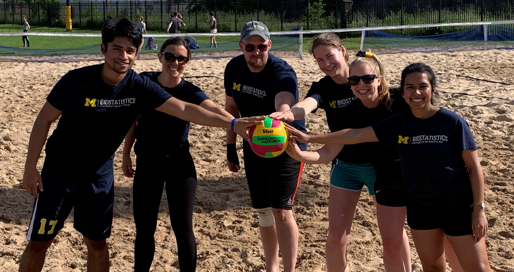
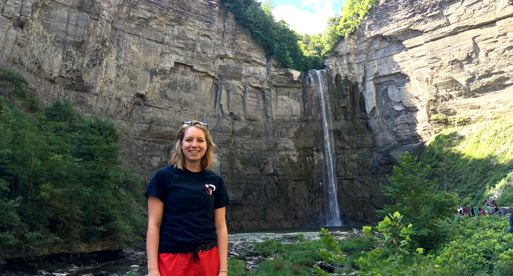

 <h1>About Me</h1> 

- Alum of [Carnegie Mellon Swimming and Diving](http://athletics.cmu.edu/sports/wswimdive/index)   
    + Here is a [reflection](https://thetartan.org/2018/4/2/sports/athleteprofile) on my swimming career
    + Even though I am retired, my [team profile](https://athletics.cmu.edu/sports/wswimdive/2017-18/bios/hochstedler_kim_zazq?view=bio) is still up!    

- I have enjoyed my time as a "swammer" with [Ann Arbor Masters Swim](https://www.a2gov.org/departments/Parks-Recreation/parks-places/mack/Pages/default.aspx)

- Proud member of UM Biostatistics intramural softball, sand volleyball, wallyball and inner tube basketball teams!

- Eager to explore all the hiking and ice cream that Ithaca has to offer!

