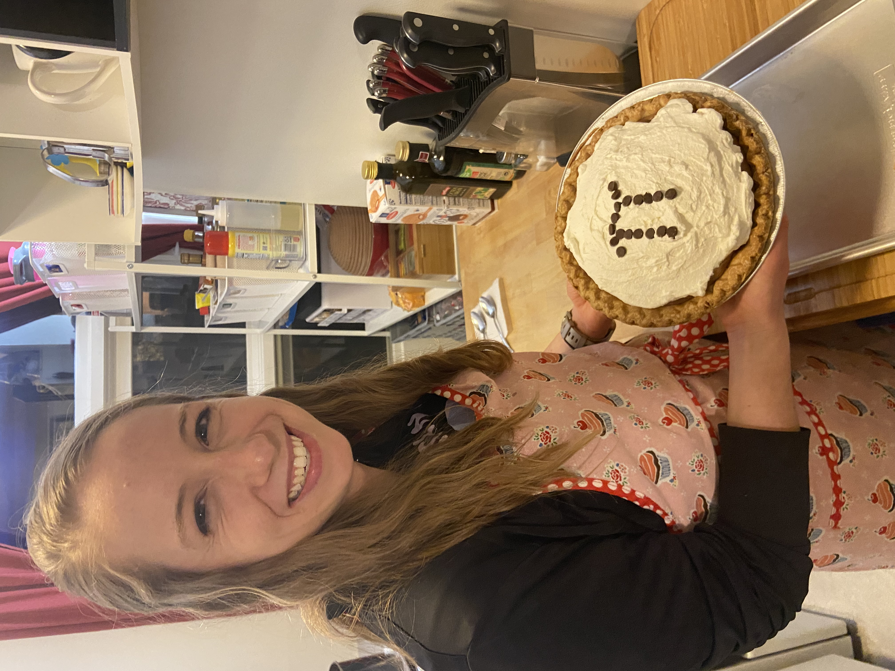

 <h1>About Me</h1> 

- Alum of [Carnegie Mellon Swimming and Diving](http://athletics.cmu.edu/sports/wswimdive/index)   
    + Here is a [reflection](https://thetartan.org/2018/4/2/sports/athleteprofile) on my swimming career
    + Even though I am retired, my [team profile](https://athletics.cmu.edu/sports/wswimdive/2017-18/bios/hochstedler_kim_zazq?view=bio) is still up!    

- I have enjoyed my time as a "swammer" with [Ann Arbor Masters Swim](https://www.a2gov.org/departments/Parks-Recreation/parks-places/mack/Pages/default.aspx)
- I recently tried open water swimming in Cayuga Lake!

- I love exploring hiking trails in the Finger Lakes region with family and friends.
- My favorite hiking spots are [Robert H. Treman State Park](https://parks.ny.gov/parks/roberttreman/) and [Taughannock Falls State Park](https://parks.ny.gov/parks/taughannockfalls) (pictured here).

- I like to bake for special occasions, like Pi Day, where I made my favorite [chocolate red raspberry cream pie](https://www.facebook.com/Essenhaus/photos/chocolate-and-red-raspberry-yes-please-the-chocolate-red-raspberry-cream-pie-has/2514185398610472/) with a stenciled cocoa powder $\pi$.

