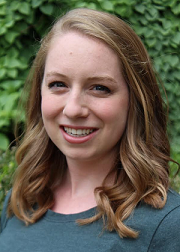

<center> <h1>Kim Hochstedler</h1> </center>

<center>
Ph.D. Student in [Statistics at Cornell University](https://stat.cornell.edu/)  
**Pronouns:** she/her
</center>

</div>
<div style="margin-bottom:20px;">
</div>

<center>

</center>

</div>
<div style="margin-bottom:20px;">
</div>

<center>
I am a Ph.D. student in the Department of Statistics at Cornell University. I received my MS in Biostatistics from the University of Michigan in 2020 and graduated with my BS in Statistics and Psychology from Carnegie Mellon University in 2018. My current research is involves developing statistical methods for misclassified outcome data. I am interested in applications in psychology, criminal justice, and decision making. 
   
Please find my CV [here](https://raw.github.com/kimhochstedler/documents/master/KA_Hochstedler_CV.pdf).   
</center>

</div>
<div style="margin-bottom:20px;">
</div>

<center> <h3>My Timeline</h3> </center>

```{r, echo = F, warning = F, fig.width=10, fig.align='center'}
library(timevis)
      
data <- data.frame(
  id      = 1:10,
  content = c("Carnegie Mellon", "SIBS", "Helgeson Lab", "NIH",
              "UMich", "MROQC", "Cornell", "CTI", "rddapp", "LinkedIn"),
  start   = c("2014-08-28", "2015-06-07", "2015-01-15", "2017-05-22",
              "2018-09-01", "2018-09-01",
              "2020-08-24",
              "2021-08-24", "2021-08-26", "2022-08-22"),
  end     = c("2018-05-20", "2015-07-15", "2018-05-20", "2017-08-11",
              "2020-04-30", "2020-08-13",
              "2024-01-01",
              "2023-05-21", "2022-05-20", "2023-05-21"),
  style = c("background-color: #b00; border-color: #666; color: #e0e0e0",
            "background-color: #c5050c; border-color: #f7f7f7; color: #f7f7f7",
            "background-color: #e0e0e0; border-color: #b00; color: #666",
            "background-color: #0C5691; border-color: #626466; color: white",
            "background-color: #FFCB05; border-color: #00274C; color: #00274C",
            "background-color: #4952A7; border-color: #B3CDD6; color: white",
            "background-color: #B31B1B; border-color: #222222; color: #FFFFFF",
            "background-color: #497792; border-color: #3D5062; color: #EBF5F9",
            "background-color: white; border-color: red; color: black",
            "background-color: #0077B5; border-color: #000000; color: #FFFFFF"))

timevis(data, width = 1000, height = 200,
        options = list(
    onAdd = htmlwidgets::JS('function(item, callback) {
      item.content = "New item! You visited my page";
      callback(item);
    }')
  ))

```


- **Carnegie Mellon:** BS in [Statistics](http://www.stat.cmu.edu/) and [Psychology](https://www.cmu.edu/dietrich/psychology/index.html) from [Carnegie Mellon University](https://www.cmu.edu/)
- **SIBS:** Student with the [Summer Institute in Biostatistics](https://www.nhlbi.nih.gov/grants-and-training/summer-institute-biostatistics) at the [University of Wisconsin - Madison](https://stat.wisc.edu/)
- **Helgeson Lab:** Member of the [Gender, Relationships, and Health Lab](https://www.cmu.edu/dietrich/psychology/gender-relationships-health/) 
- **NIH:** Intern at the National Institutes of Health, in the Epidemiology Branch of the [Eunice Kennedy Shriver National Institute of Child Health and Human Development](https://www.nichd.nih.gov/about/org/diphr/officebranch/eb)
    + Worked with the [Upstate New York Infant Development Screening Program (Upstate KIDS)](https://www.nichd.nih.gov/about/org/diphr/officebranch/eb/infant-development)
- **UMich:** MS in [Biostatistics](https://sph.umich.edu/biostat/) from the [University of Michigan School of Public Health](https://sph.umich.edu/)
- **MROQC:** Statistician with the [Michigan Radiation Oncology Quality Consortium](https://www.mroqc.org/)
- **Cornell:** PhD Student in [Statistics](https://stat.cornell.edu/) at [Cornell University](https://www.cornell.edu/)
- **CTI:** Lead-fellow in Cornell University's Center for Teaching Innovation [Graduate Teaching Fellowship](https://teaching.cornell.edu/cti-graduate-teaching-fellowship)
- **rddapp:** Research assistantship with [Felix Thoemmes](https://www.human.cornell.edu/people/fjt36) to update the ["rddapp" R package](https://www.felixthoemmes.com/rddapp/)
- **LinkedIn:** PhD research fellow with the [Bowers CIS Strategic Partnership Program with LinkedIn](https://news.cornell.edu/stories/2022/03/linkedin-cornell-bowers-cis-launch-strategic-partnership)

