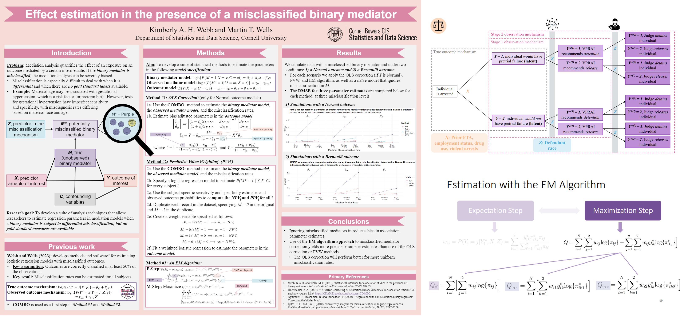

<h1>Presentations</h1>

::: {style="margin-bottom:20px;"}
:::

::: {style="margin-bottom:20px;"}
:::

## Selected Presentations

Please see a full list on my [CV](https://github.com/kimberlywebb/docs/blob/11d4d708f192acc19efeb51a88e4813172804aac/KAH_Webb_CV.pdf?raw=true).

$~$
$~$

#### Upcoming

-   **KAH Webb** and MT Wells, "The misdiagnosed mediator: Estimating the effect of maternal age on preterm birth risk in the presence of misclassified gestational hypertension". Topic-contributed talk at the *Joint Statistical Meetings (JSM)*, Nashville, TN. August 2025.

$~$

#### Past
-   **KAH Webb**, "Nobody's (data is) perfect: How misclassified data biases study results, and what to do about it". Invited talk at the *University of Pittsburgh Health Services Research Seminar Series*, Pittsburgh, PA. April 2024.

-   **KAH Webb**, SA Riley, and MT Wells, ["An assessment of racial disparities in pretrial decision-making using misclassification models"](https://github.com/kimberlywebb/docs/blob/3b5a4b01ad8daaa72c21d64937074891d4336f12/KAH_Webb_ENAR2025_Slides_WebsiteVersion.pdf?raw=true). Contributed talk at the *Eastern North American Region (ENAR) International Biometric Society*, New Orleans, LA. March 2025.

-   **KAH Webb** and MT Wells, ["Effect estimation in the presence of a misclassified binary mediator"](https://github.com/kimberlywebb/docs/blob/0dc46489b01436856aa56630cfd117b8f81a34df/KAH_Webb_WSDS2024_slides_website_version.pdf?raw=true). Invited talk at *Women in Statistics and Data Science*, Reston, VA. October 2024.

-   **KAH Webb**, SA Riley, and MT Wells, ["An assessment of racial disparities in pretrial decision-making using misclassification models"](https://github.com/kimberlywebb/docs/blob/f9ce847a3ce17316370fb4a6e9044c39683b00ff/KAH_Webb_JSM2024_Slides_WebsiteVersion.pdf?raw=true). Contributed talk at the *Joint Statistical Meetings (JSM)*, Portland, OR. August 2024. 

-   **KAH Webb** and MT Wells, ["Effect estimation in the presence of a misclassified binary mediator"](https://github.com/kimberlywebb/docs/blob/98d5153509436d0a66d1160b5056abc5bc16e6d6/KAH_Webb_ENAR_March2024_Slides.pdf?raw=true). Contributed talk at the *Eastern North American Region (ENAR) International Biometric Society*, Baltimore, MD. March 2024.

-   **KAH Webb**, "Modeling misdiagnosis in biomedical and public health association studies: Implications for health disparities research". Invited talk at the *University of Pittsburgh Health Services Research Seminar Series*, Pittsburgh, PA. December 2023.

-   **KAH Webb** and MT Wells, ["Effect estimation in the presence of a misclassified binary mediator"](https://github.com/kimberlywebb/docs/blob/0b534c48d3249fe7a28e64c263bc7c64aaeb5c06/Webb_Cornell_poster_2023-09-01.pdf?raw=true). Contributed poster at the *Celebration of Statistics and Data Science*, Ithaca, NY. September 2023.

-   **KAH Webb** and MT Wells, ["Statistical inference for association studies in the presence of binary outcome misclassification"](https://raw.github.com/kimhochstedler/documents/master/KA_Hochstedler_ENAR2023_Slides.pdf). Contributed talk at the *Eastern North American Region (ENAR) International Biometric Society*, Nashville, TN. March 2023.

-   **KA Hochstedler**, F Fang, R Tamura, T Braun, K Kidwell. ["Bayesian methods to compare dose levels to placebo in a small n sequential multiple assignment randomized trial (snSMART)"](https://raw.github.com/kimhochstedler/documents/master/enar2020_slides.pptx). Contributed talk at the *Eastern North American Region (ENAR) International Biometric Society*, Virtual. March 2020.

+   **KA Hochstedler**, V Helgeson, H Seltman. ["Meta-Analytic Review of Pronoun Use and Health and Relationship Outcomes"](https://raw.github.com/kimhochstedler/documents/master/sbm2018_poster.pptx). *Society of Behavioral Medicine*. New Orleans, LA. April 2018.

$~$

