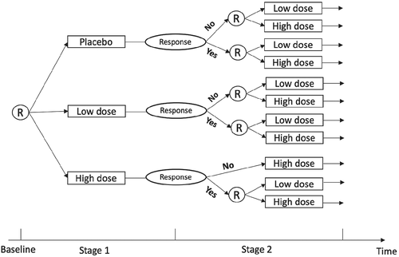

<h1>Research</h1>

::: {style="margin-bottom:20px;"}
:::

::: {style="margin-bottom:20px;"}
:::

In my research, I aim to answer questions in public health and the social sciences by leveraging the complex mechanisms that underlie the data generation process. In observational studies, data may be imperfectly measured and using the observed, but potentially mismeasured, data can cause bias in statistical estimates. Importantly, this measurement problem does not dissipate with increasing sample size. Thus, even in the age of “big data”, statistical methodology for handling data measured with error is still particularly important.

In designing novel statistical methodology for imperfect data, I develop tools to answer scientific questions and better understand the world around us. To further my goal of creating and applying useful statistical tools to address impactful problems, I seek out collaborations with social and public health scientists. I aim to share my methods with fellow statisticians and applied researchers by developing user-friendly software to accompany my methodological contributions.

$~$

## Misclassification of Binary Variables

Much of my recent research is aimed at creating statistical methods for dealing with differential misclassification in binary outcome and mediator variables. In particular, I consider cases where a gold standard measure is not available— making validation studies impossible. I have applied these methods to study patterns of misdiagnosis in diseases like myocardial infarction and gestational hypertension. 

#### Related Papers
-   **KAH Webb** and MT Wells, "Effect estimation in the presence of a misclassified binary mediator" [arXiv:2407.06970v2](https://arxiv.org/abs/2407.06970).

-   **KAH Webb** and MT Wells, "Statistical inference for association studies in the presence of binary outcome misclassification". In press at *Statistics in Medicine*. [arXiv:2303.10215](https://arxiv.org/abs/2303.10215).

$~$
$~$

## Clinical Trial Design and Methodology
I have also focused on designing clinical trials for specialized settings, including rare diseases. Because of the limited number of individuals affected by rare diseases, it is often difficult to accrue enough participants in trials for new treatments and thus these trials suffer from reduced power. In response to these challenges, I, along with my colleagues, developed a new small n, sequential, multiple assignment, randomized trial (snSMART) that is specifically intended for small samples.

#### Related Papers
-   **KA Hochstedler**${^*}$, F Fang${^*}$, R Tamura, T Braun, K Kidwell. "Bayesian methods to compare dose levels to placebo in a small n sequential multiple assignment randomized trial (snSMART)" February 2021. *Statistics in Medicine* [DOI:10.1002/sim.8813](https://doi.org/10.1002/sim.8813)

    -   $*$ Denotes co-first author.

$~$
$~$

## Scientific Tools for Clinicians and Statisticians
My collaborative work has aimed to answer clinically valuable questions various areas of healthcare research, with a focus on creating useful scientific tools for clinicians and statisticians. Alongside methodological developments, I develop R packages so that fellow researchers can use the tools I created in their own work. In addition, I create R Shiny web applications so that scientists and clinicians can access new research tools in a user-friendly way. For a full list of my software, applications, and tutorials, please visit my "Software" page, [here](https://kimhwebb.com/software.html). 

#### Related Projects
- **KAH Webb** (2024). [COMBO: Correcting Misclassified Binary Outcomes in Association Studies](https://kimberlywebb.github.io/COMBO/). R package version 1.1.0.

- **KAH Webb** (2024). [COMMA: Correcting Misclassified Mediation Analysis](https://kimberlywebb.github.io/COMMA/). R package version 1.0.0.

- **KA Hochstedler** (2019). [Pneumonitis Prediction App](https://ppa.mroqc.org/). 

$~$
$~$

## Fairness in Pretrial Detention Decisions
The increasing use of algorithms for decision-making poses a challenge for our society. For example, risk assessment algorithms have been developed and deployed to aid in pretrial detention decisions within in the criminal justice system. While these tools were designed to make predictions with greater accuracy than judges, there is still concern that risk assessment algorithms may be biased against minority groups. I aim to understand potential biases in algorithmic decision-making by viewing the bias a "noisy labels" or misclassification problem, and developing misclassification modeling approaches to quantify prediction accuracy across groups in the data. 

#### Related Papers
-   **KAH Webb**, SA Riley, and MT Wells, "An assessment of racial disparities in pretrial decision-making using misclassification models". [arXiv:2309.08599](https://arxiv.org/abs/2309.08599).

$~$

